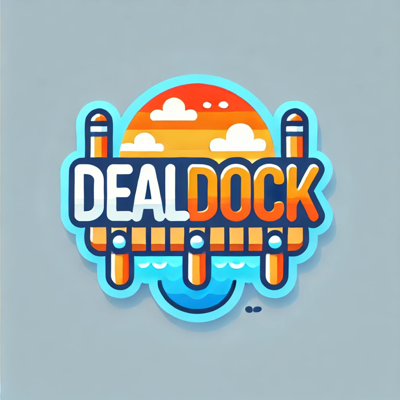

# Deal Dock - Front-End

Deal Dock is a full-stack MERN (MongoDB, Express, React, Node.js) application designed to facilitate buying, selling, and bidding on products. It includes full CRUD operations for products with secure JWT authentication. Users can interact with products, bid, comment, and manage their own listings.

## 📸 Logo
**

## 📖 About the App
Deal Dock enables users to:
- **Sign up and log in** securely using JWT authentication.
- **Create, update, and delete products** they own. Users cannot modify products created by others.
- **Browse products** on the **Shop page**, where all products (name, image, and Buy Now price) are listed.
- **View detailed product information** on the Product Details page, including:
  - Name, description, starting bid, current bid, Buy Now price, image, and seller name.
  - View and add comments about the product.
  - A bidding feature to bid on products.
- **Access a personal dashboard** to manage products they’ve created and add new ones.

## 🚀 Getting Started
- **Deployed App**: [DealDock](https://dealdock.netlify.app/)
- **Planning Materials**: [Trello](https://trello.com/b/tzczPjmw/dealdock)
- [**Back-End Repository**](https://github.com/lh-25/DealDock-Backend)

## 🛠️ Technologies Used
- **Frontend**:
  - React.js
  - React Router
  - Axios and Fetch API

## 📈 Next Steps
Here are some planned enhancements for Deal Dock:
1. Add ability to reply to others comments.
3. Enable search and filter functionality for the Shop page.
4. **Add a shopping cart** so users can buy products directly from the platform.
5. Integrate payment services to handle transactions securely.
6. Enhance the **Seller Page** with seller reviews and ratings.
7. Improve UI accessibility and responsiveness.
8. Add an image upload feature for product images.

